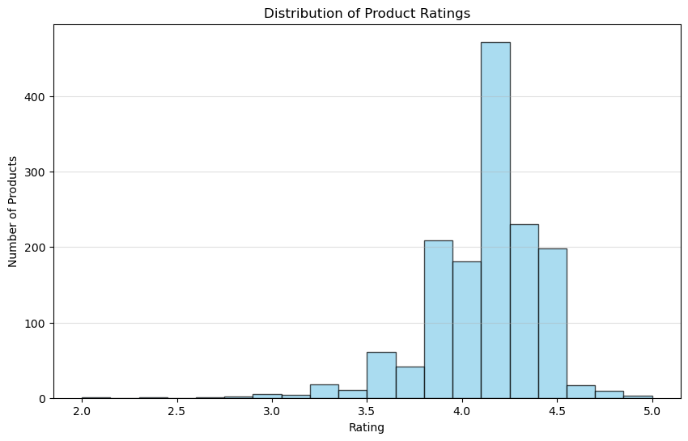
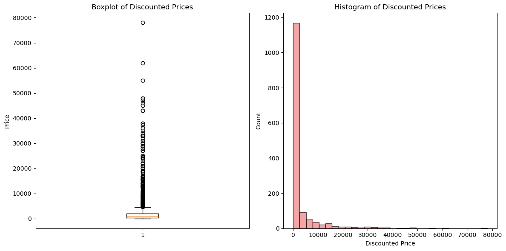
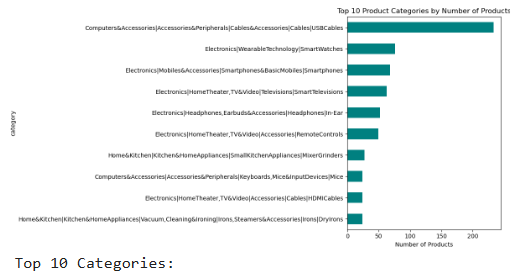
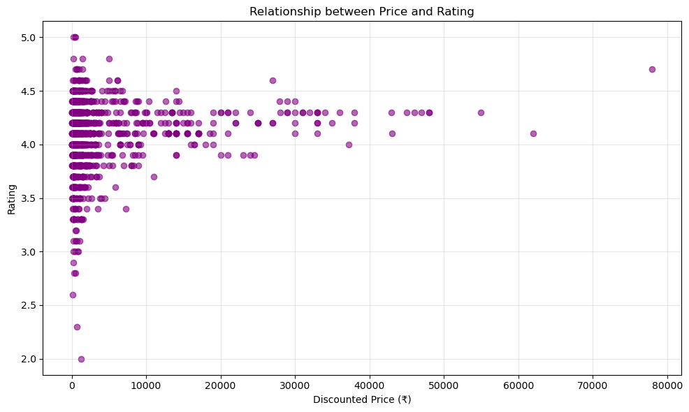

# Amazon E-Commerce Sales Data Analysis

## Overview
This project analyzes a dataset of Amazon products to uncover insights into pricing, discounts, ratings, and categories. The goal was to clean the raw data and perform exploratory data analysis (EDA) to answer key business questions.

## Tools Used
- **Python:** Pandas, NumPy, Matplotlib, Seaborn
- **Jupyter Notebook**
- **Git & GitHub**

## Dataset
- **Source:** [Amazon Product Dataset on Kaggle](https://www.kaggle.com/datasets/karkavelrajaj/amazon-sales-dataset)
- **Contents:** 1,465 products with features like product name, category, discounted price, actual price, rating, and rating count.

## Data Cleaning Process
1.  Handled missing values in the `rating_count` column.
2.  Converted `discounted_price`, `actual_price`, and `rating` from strings to numeric types by removing currency symbols (₹) and commas.
3.  Ensured data consistency for accurate analysis.

## Exploratory Data Analysis (EDA) & Key Insights

### 1. Distribution of Product Ratings

- **Insight:** The average product rating was **{your average rating here}** out of 5, with most products receiving high ratings between 4 and 4.5.

### 2. Analysis of Discounted Prices

- **Insight:** The majority of products were priced under **₹{your max common price}**, with a median price of **₹{your median price}**. This shows a market focus on affordable products.

### 3. Top Product Categories

- **Insight:** The top category was **"{your top category name}"** with **{number}** products, indicating a high demand or saturation in this market segment.

### 4. Price vs. Rating Relationship

- **Insight:** The correlation between price and rating was **{your correlation value}**, suggesting **{e.g., a weak relationship}**. High ratings are found across all price points.

## How to Run This Project
1.  Clone this repository.
2.  Install the required libraries: `pip install pandas numpy matplotlib seaborn jupyter`
3.  Open the `Sales_Analysis.ipynb` file in Jupyter Notebook.
4.  Run all cells to reproduce the analysis.
